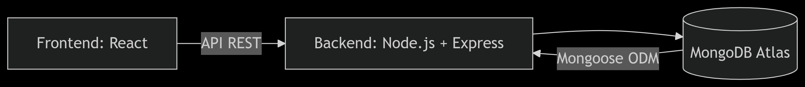

# **Sistema de Facturación SIMIC - Documentación Completa**

**Desarrollado por:** Ludwing Santiago Villamizar Murillo.

------

## **🔍 Introducción**

El **Sistema de Facturación SIMIC** es una solución integral para la gestión de ventas, compras y control de inventario en el sector farmacéutico. Permite:
✅ **Registro de clientes** (cupo crediticio, plazo de pago).
✅ **Gestión de artículos** (stock, costos, laboratorios).
✅ **Facturación flexible** (compras a proveedores y ventas a clientes).
✅ **Reportes automatizados** (ventas, ganancias, kardex).

### **🔗 Demo en Producción**

👉 https://somic-facturacion-production.up.railway.app/

**¡No requiere instalación!**

- Esta versión está **totalmente funcional en la nube** (Railway).
- **Datos de prueba pre-cargados** para explorar todas las funcionalidades.

**¿Quieres instalarlo localmente?**
→ Consulta la rama `desarrollador` en el repositorio para instrucciones paso a paso sobre la instalación, levantamiento local y conexión a la base de datos para que puedas replicarlo en un entorno más técnico.

→ En la rama `desarrollador` el README es totalmente distinto y sirve para probar todo mas minuciosamente y habla más sobre la construcción y funcionalidad del código.

→ En caso de que solo quieras probar el proyecto sin mirar la parte de la construcción o levantamiento local sigue este mismo README y prueba el proyecto directamente entrando al enlace mencionado a anteriormente.

------

## **📋 Requerimientos Funcionales**

### **1. Gestión de Clientes**

| ID    | Función           | Validaciones y Restricciones                                 |
| :---- | :---------------- | :----------------------------------------------------------- |
| AF-01 | Registrar cliente | - NIT debe ser único. - Cupo y plazo en días deben ser números positivos. |
| AF-02 | Consultar cliente | - Muestra alerta si el NIT no existe. - Incluye cálculo automático de cartera/disponible. |
| AF-03 | Listar clientes   | - Paginación con 10 registros por página. - Filtro combinado (NIT + nombre). |

### **2. Gestión de Artículos**

| ID    | Función            | Validaciones y Restricciones                                 |
| :---- | :----------------- | :----------------------------------------------------------- |
| AF-06 | Crear artículo     | - Código único. - Saldo y costos ≥ 0. - Precio de venta ≥ costo unitario. |
| AF-07 | Consultar artículo | - Muestra historial de movimientos (kardex) vinculados a facturas. |
| AF-08 | Listar artículos   | - Búsqueda por código, nombre o laboratorio. - Ordenable por saldo o precio. |

### **3. Gestión de Facturas**

| ID    | Función         | Validaciones y Restricciones                                 |
| :---- | :-------------- | :----------------------------------------------------------- |
| AF-11 | Crear factura   | **Validaciones clave:** - **Para ventas (-):** - Stock ≥ unidades. - Total ≤ disponible del cliente. - **Para compras (+):** - Unidades > 0 (entero). - Costo unitario editable (actualiza BD). - Genera número aleatorio único (FE + 10 dígitos). |
| AF-12 | Listar facturas | - Filtros por: - Rango de fechas. - Estado (pendiente/pagada). - Cliente (NIT). |
| AF-13 | Cambiar estado  | - Solo transición **pendiente → pagada**. - Registra fecha/hora exacta del cambio. |

------

## **🖥️ Guía Rápida de Interfaces**

### **📝 Crear Factura**

1. **Selecciona un cliente** del dropdown (carga automáticamente sus datos: cupo, cartera y disponible).
2. **Elige un artículo** (muestra stock actual, costo y precio de venta).
3. **Selecciona naturaleza**:
   - ➕ **Positiva (+)**: Compra (aumenta stock)
     - ✏️ **Costo unitario editable** (se actualiza en BD al guardar).
   - ➖ **Negativa (-)**: Venta (reduce stock)
     - ✏️ **Precio de venta editable** (debe ser ≥ costo).
4. **Ingresa cantidad**:
   - 🔢 **Entero positivo** (no acepta 0 o decimales).
   - Para ventas: ❗No puede superar el stock disponible.
5. **Agrega artículo** → Repite para múltiples productos.
6. **Guarda factura**:
   - 🔢 Genera número único (FE + 10 dígitos aleatorios).
   - 📅 Fecha de vencimiento automática (fecha actual + plazo del cliente).

✅ **Validaciones clave**:
✔ Precio de venta ≥ costo unitario (para naturaleza negativa).
✔ Unidades > 0 (entero positivo).
✔ Al guardar:

- Actualiza cartera del cliente (si es negativa) y afecta su disponible.
- Si es negativa y se modificó precio: actualiza precio de venta en BD.
- Si es positiva: actualiza costo unitario en BD.
  ❌ Bloquea si:
- Stock insuficiente.
- Total excede cupo disponible.

------

### **👥 Registrar Cliente**

1. Completa campos:
   - **NIT** (🔤 String único, obligatorio).
   - **Nombre** (🔤 String, obligatorio).
   - **Cupo** (💰 Number > 0).
   - **Plazo** (📅 Entero positivo).
2. **Guardar**:
   - ✔ Valida que el NIT no exista previamente.
   - ✔ Formato correcto de todos los campos.

✅ **Validaciones clave**:
✔ Nombre debe ser texto (no números/símbolos).
✔ Cupo y plazo deben ser números positivos.

------

### **🛍️ Registrar Artículo**

1. Ingresa datos:
   - **Código** (🔤 String único).
   - **Nombre** (🔤 String).
   - **Laboratorio** (🔤 String).
   - **Saldo inicial** (🔢 Number ≥ 0).
   - **Costo** (💰 Number > 0).
   - **Precio venta** (💰 Number ≥ costo).
2. **Guardar**:
   - ✔ Rechaza códigos duplicados.
   - ✔ Valida precio ≥ costo.

✅ **Validaciones clave**:
✔ Código y nombre deben ser texto válido.
✔ Saldo, costo y precio deben ser números positivos.

------

**📊 Ver Facturas**

- **Filtra por**:
  - 🔍 Cliente (NIT)
  - 📅 Rango de fechas
  - 🟢/🔴 Estado (pagada/pendiente)
- **Acciones**:
  - 👁️ Ver detalle completo de cualquier factura.
  - 💾 Exportar a Excel (en versión 2.0).

------

### **📦 Kardex**

Muestra **todos los movimientos** de artículos:

- 🔄 Filtra por producto o factura.
- 📈 Calcula totales de compras/ventas.
- 🔗 Enlace directo a la factura relacionada.

------

## **⚙️ Reglas de Negocio Clave**

### **🔹 Creación de Facturas**

#### **Precondiciones**

✔ Cliente registrado con cupo disponible.
✔ Artículos con stock suficiente (para ventas).

#### **Proceso**

1. **Selección de Cliente:**
   - Sistema muestra:
     - **Cupo total** (ej: $100,000).
     - **Cartera pendiente** (suma facturas no pagadas).
     - **Disponible** (cupo – cartera).
2. **Agregar Artículos:**
   - **Naturaleza Positiva (+):**
     - *Ejemplo:* Compra a laboratorio.
     - Aumenta stock.
     - **Costo editable** (actualiza BD al guardar).
   - **Naturaleza Negativa (–):**
     - *Ejemplo:* Venta a farmacia.
     - Valida que:
       - **Stock ≥ unidades solicitadas.**
       - **Total venta ≤ disponible del cliente.**
     - **Precio editable** (debe ser ≥ costo).
3. **Validaciones Automáticas:**
   - Si se intenta vender más unidades que el stock → **Ajusta al máximo disponible.**
   - Si el total supera el cupo → **Bloquea guardado.**
4. **Guardado:**
   - Genera **número único** (ej: `FE2837492016`).
   - Calcula **fecha de vencimiento** (fecha actual + plazo del cliente).
   - Actualiza:
     - **Stock** (aumenta/disminuye según naturaleza).
     - **Cartera del cliente** (solo para ventas).
     - **Precios** (si fueron modificados).

------

## **📂 Diseño Técnico**

### **Arquitectura**

Diagrama:

<svg role="graphics-document document" viewBox="0 0 834.90625 91.48810577392578" class="flowchart mermaid-svg" xmlns="http://www.w3.org/2000/svg" width="100%" id="mermaid-svg-13" style="max-width: 834.906px; transform-origin: 0px 0px; user-select: none; transform: translate(0px, 58.8047px) scale(1);"><g><marker orient="auto" markerHeight="8" markerWidth="8" markerUnits="userSpaceOnUse" refY="5" refX="5" viewBox="0 0 10 10" class="marker flowchart-v2" id="mermaid-svg-13_flowchart-v2-pointEnd"><path style="stroke-width: 1; stroke-dasharray: 1, 0;" class="arrowMarkerPath" d="M 0 0 L 10 5 L 0 10 z"></path></marker><marker orient="auto" markerHeight="8" markerWidth="8" markerUnits="userSpaceOnUse" refY="5" refX="4.5" viewBox="0 0 10 10" class="marker flowchart-v2" id="mermaid-svg-13_flowchart-v2-pointStart"><path style="stroke-width: 1; stroke-dasharray: 1, 0;" class="arrowMarkerPath" d="M 0 5 L 10 10 L 10 0 z"></path></marker><marker orient="auto" markerHeight="11" markerWidth="11" markerUnits="userSpaceOnUse" refY="5" refX="11" viewBox="0 0 10 10" class="marker flowchart-v2" id="mermaid-svg-13_flowchart-v2-circleEnd"><circle style="stroke-width: 1; stroke-dasharray: 1, 0;" class="arrowMarkerPath" r="5" cy="5" cx="5"></circle></marker><marker orient="auto" markerHeight="11" markerWidth="11" markerUnits="userSpaceOnUse" refY="5" refX="-1" viewBox="0 0 10 10" class="marker flowchart-v2" id="mermaid-svg-13_flowchart-v2-circleStart"><circle style="stroke-width: 1; stroke-dasharray: 1, 0;" class="arrowMarkerPath" r="5" cy="5" cx="5"></circle></marker><marker orient="auto" markerHeight="11" markerWidth="11" markerUnits="userSpaceOnUse" refY="5.2" refX="12" viewBox="0 0 11 11" class="marker cross flowchart-v2" id="mermaid-svg-13_flowchart-v2-crossEnd"><path style="stroke-width: 2; stroke-dasharray: 1, 0;" class="arrowMarkerPath" d="M 1,1 l 9,9 M 10,1 l -9,9"></path></marker><marker orient="auto" markerHeight="11" markerWidth="11" markerUnits="userSpaceOnUse" refY="5.2" refX="-1" viewBox="0 0 11 11" class="marker cross flowchart-v2" id="mermaid-svg-13_flowchart-v2-crossStart"><path style="stroke-width: 2; stroke-dasharray: 1, 0;" class="arrowMarkerPath" d="M 1,1 l 9,9 M 10,1 l -9,9"></path></marker><g class="root"><g class="clusters"></g><g class="edgePaths"><path marker-end="url(#mermaid-svg-13_flowchart-v2-pointEnd)" style="" class="edge-thickness-normal edge-pattern-solid edge-thickness-normal edge-pattern-solid flowchart-link" id="L_A_B_0" d="M183.438,45.744L192.813,45.744C202.188,45.744,220.938,45.744,239.021,45.744C257.104,45.744,274.521,45.744,283.229,45.744L291.938,45.744"></path><path marker-end="url(#mermaid-svg-13_flowchart-v2-pointEnd)" style="" class="edge-thickness-normal edge-pattern-solid edge-thickness-normal edge-pattern-solid flowchart-link" id="L_B_C_0" d="M552.563,35.79L565.551,34.782C578.539,33.775,604.516,31.759,629.83,32.189C655.144,32.62,679.797,35.495,692.123,36.933L704.449,38.371"></path><path marker-end="url(#mermaid-svg-13_flowchart-v2-pointEnd)" style="" class="edge-thickness-normal edge-pattern-solid edge-thickness-normal edge-pattern-solid flowchart-link" id="L_C_B_0" d="M708.422,52.654L695.434,54.169C682.445,55.684,656.469,58.714,631.157,59.273C605.845,59.832,581.198,57.92,568.874,56.964L556.551,56.008"></path></g><g class="edgeLabels"><g transform="translate(239.6875, 45.74405288696289)" class="edgeLabel"><g transform="translate(-31.25, -12)" class="label"><foreignObject height="24" width="62.5">

API REST

</foreignObject></g></g><g class="edgeLabel"><g transform="translate(0, 0)" class="label"><foreignObject height="0" width="0">

</foreignObject></g></g><g transform="translate(630.4921875, 61.74405288696289)" class="edgeLabel"><g transform="translate(-52.9296875, -12)" class="label"><foreignObject height="24" width="105.859375">

Mongoose ODM

</foreignObject></g></g></g><g class="nodes"><g transform="translate(95.71875, 45.74405288696289)" id="flowchart-A-0" class="node default"><rect height="54" width="175.4375" y="-27" x="-87.71875" style="" class="basic label-container"></rect><g transform="translate(-57.71875, -12)" style="" class="label"><rect></rect><foreignObject height="24" width="115.4375">

Frontend: React

</foreignObject></g></g><g transform="translate(424.25, 45.74405288696289)" id="flowchart-B-1" class="node default"><rect height="54" width="256.625" y="-27" x="-128.3125" style="" class="basic label-container"></rect><g transform="translate(-98.3125, -12)" style="" class="label"><rect></rect><foreignObject height="24" width="196.625">

Backend: Node.js + Express

</foreignObject></g></g><g transform="translate(767.6640625, 45.74405288696289)" id="flowchart-C-3" class="node default"><path transform="translate(-59.2421875, -37.748251299493035)" style="" class="basic label-container" d="M0,12.165500866328692 a59.2421875,12.165500866328692 0,0,0 118.484375,0 a59.2421875,12.165500866328692 0,0,0 -118.484375,0 l0,51.16550086632869 a59.2421875,12.165500866328692 0,0,0 118.484375,0 l0,-51.16550086632869"></path><g transform="translate(-51.7421875, -2)" style="" class="label"><rect></rect><foreignObject height="24" width="103.484375">

MongoDB Atlas

</foreignObject></g></g></g></g></g></svg>

### **Base de Datos (MongoDB)**

#### **📌 Colección `clientes`**

| Campo        | Tipo   | Descripción                      |
| :----------- | :----- | :------------------------------- |
| `documento`  | String | NIT único (PK).                  |
| `nombre`     | String | Razón social.                    |
| `cupo`       | Number | Límite crediticio ($).           |
| `plazo_dias` | Number | Días para pago.                  |
| `cartera`    | Number | Suma de facturas pendientes ($). |

#### **📌 Colección `articulos`**

| Campo          | Tipo   | Descripción               |
| :------------- | :----- | :------------------------ |
| `codigo`       | String | Código único (PK).        |
| `nombre`       | String | Descripción del producto. |
| `laboratorio`  | String | Fabricante.               |
| `saldo`        | Number | Unidades en inventario.   |
| `costo_unidad` | Number | Precio de compra.         |
| `precio_venta` | Number | Precio sugerido de venta. |

#### **📌 Colección `facturas`**

| Campo               | Tipo   | Descripción                      |
| :------------------ | :----- | :------------------------------- |
| `numero`            | String | Número único (ej: `FE2025001`).  |
| `fecha`             | Date   | Fecha de emisión.                |
| `fecha_vencimiento` | Date   | Fecha de pago (fecha + plazo).   |
| `nit_cliente`       | String | Ref. a `clientes.documento`.     |
| `total_Venta`       | Number | Suma de artículos vendidos ($).  |
| `total_Costo`       | Number | Suma de artículos comprados ($). |
| `estado`            | String | `pendiente` o `pagada`.          |

#### **📌 Colección `facturakardex`**

| Campo                   | Tipo   | Descripción                      |
| :---------------------- | :----- | :------------------------------- |
| `numero_factura`        | String | Ref. a `facturas.numero`.        |
| `codigo_articulo`       | String | Ref. a `articulos.codigo`.       |
| `naturaleza`            | String | `positiva (+)` o `negativa (-)`. |
| `unidades`              | Number | Cantidad transaccionada.         |
| `precio_venta_unitario` | Number | Precio unitario (ventas).        |
| `costo_unitario`        | Number | Costo unitario (compras).        |

------

## **🔮 Futuras Mejoras**

### **Versión 2.0 (Roadmap)**

- **📊 Dashboard financiero:** Gráficos de ventas, comparativo mensual.
- **📱 App móvil:** Notificaciones push para vencimientos.
- **🧾 Pagos parciales:** Registrar abonos a facturas.
- **🔐 Autenticación:** Roles (admin, vendedor).

------

## **🛠️ Tecnologías Utilizadas**

| **Área**        | **Tecnologías**                         |
| :-------------- | :-------------------------------------- |
| Frontend        | React, CSS Modules, Axios, React Router |
| Backend         | Node.js, Express, Mongoose              |
| Base de Datos   | MongoDB Atlas                           |
| Deployment      | Railway (Fullstack)                     |
| Control Versión | Git + GitHub                            |

------

## **📌 Notas Adicionales**

✅ **100% Responsive:** Adaptable a móviles, tablets y desktop.
⚡ **Optimizado:** Carga diferida (lazy loading) en listados extensos.
🔐 **Persistencia:** Cookies guardan facturas en progreso.

------

## **📌 Notas Clave para Pruebas**

✅ **Datos de prueba en la demo:**

- Cliente ejemplo: NIT `123` (Cupo: $80,000).
- Artículo ejemplo: Código `ACX100` (Stock: 150 unidades).

⚠️ **Errores comunes simulados:**

- Intentar vender 200 unidades de `ACX100` → Ajusta a 150.
- Facturar $90,000 al cliente `123` → Bloqueo por cupo insuficiente.

------

## **🔗 Acceso y Pruebas**

👉 **Demo Online:** https://somic-facturacion-production.up.railway.app/
📦 **Código Fuente:** Disponible en GitHub (rama `master` para producción, `desarrollador` para desarrollo local).

------

**🎯 Objetivo Cumplido:** Sistema listo para producción con capacidad de escalar a más módulos. 🚀